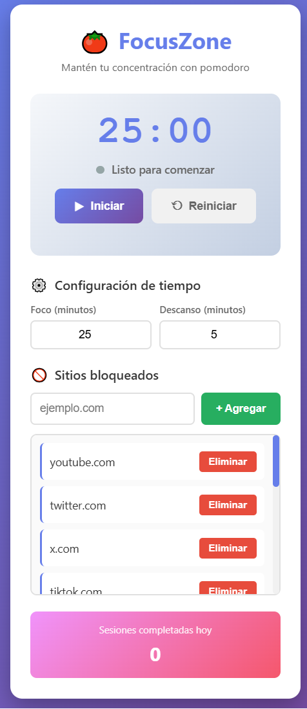
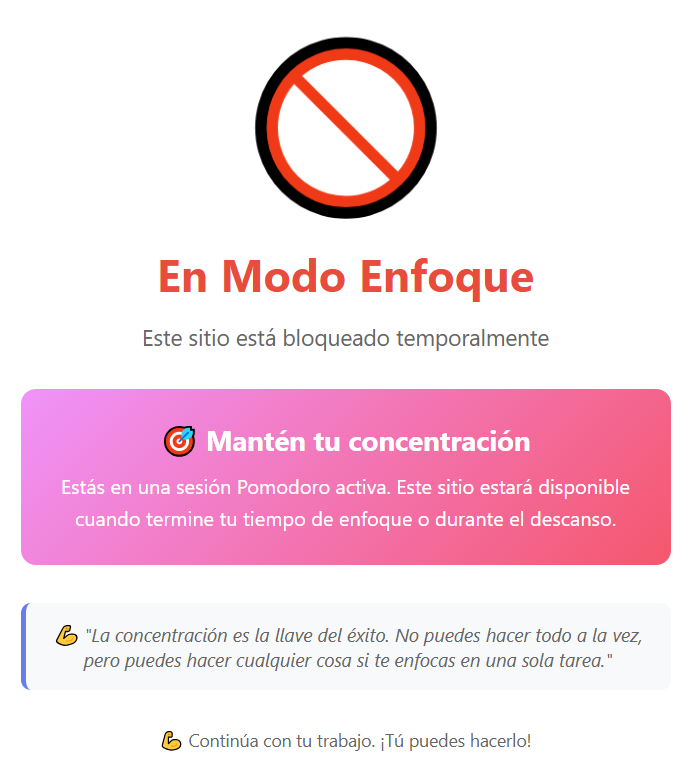

# 🍅 FocusZone - Bloqueador pomodoro

<p align="center">
  <table>
    <tr>
      <td></td>
      <td></td>
    </tr>
  </table>
</p>

**FocusZone** es una extensión de Chrome que te ayuda a mantener tu concentración bloqueando sitios web distractores durante sesiones tipo Pomodoro (p.ej. 25 minutos de foco, 5 de descanso).

## 🎯 ¿Qué es FocusZone?

FocusZone es una herramienta de productividad basada en la **Técnica Pomodoro**, que consiste en trabajar en intervalos de tiempo enfocado (por defecto 25 minutos) seguidos de descansos cortos (5 minutos).

### ¿Cómo funciona?

1. **Inicias una sesión de enfoque** de 25 minutos
2. **Durante esos 25 minutos**, FocusZone bloquea automáticamente sitios web que te distraen (YouTube, redes sociales, etc.)
3. Si intentas visitar un sitio bloqueado, verás una **página motivacional** que te recuerda mantener el foco
4. Al completar los 25 minutos, recibes una **notificación** y comienza un descanso de 5 minutos
5. **Durante el descanso**, todos los sitios están disponibles - puedes relajarte sin restricciones

## ✨ Características

### 🎯 Temporizador pomodoro
- **25 minutos de enfoque** seguidos de **5 minutos de descanso**
- Tiempos completamente configurables según tus necesidades
- Interfaz visual clara con contador regresivo
- Botones de Iniciar/Pausar/Reiniciar

### 🚫 Bloqueo inteligente de sitios
- Bloquea automáticamente sitios distractores durante el modo enfoque
- Lista predeterminada incluye: YouTube, X/Twitter, TikTok, Instagram, Facebook, Reddit, Twitch, WhatsApp Web, Gmail
- **Lista completamente personalizable**: agrega o elimina sitios según tus necesidades
- Los sitios bloqueados muestran una página motivacional en lugar del contenido

### 📊 Seguimiento de productividad
- Contador de sesiones completadas por día
- Estadísticas de bloqueos evitados
- Notificaciones al completar sesiones

### 🎨 Interfaz moderna
- Diseño limpio y profesional con gradientes
- Indicador visual del estado (activo/inactivo)
- Responsive y fácil de usar

## 🚀 Instalación

### Opción 1: Instalación manual (modo desarrollador)

1. **Descarga esta carpeta** o clona el repositorio
2. Abre Chrome y ve a `chrome://extensions/`
3. Activa el **Modo de desarrollador** (esquina superior derecha)
4. Haz clic en **Cargar extensión sin empaquetar**
5. Selecciona la carpeta `Extensión FocusZone`
6. ¡Listo! El ícono de FocusZone aparecerá en tu barra de herramientas

### Opción 2: Descargar solo esta extensión

```bash
git clone --depth 1 --filter=blob:none --sparse https://github.com/pelejebre/extensiones_chrome.git
cd extensiones_chrome
git sparse-checkout set "Extensión FocusZone"
```

## 📖 Cómo usar

### Configuración inicial

1. **Configura los tiempos**: Por defecto son 25 min de foco y 5 de descanso
   - Puedes cambiarlos en la sección "⚙️ Configuración de Tiempo"
   
2. **Personaliza sitios bloqueados**:
   - La extensión incluye sitios comunes ya bloqueados
   - Agrega nuevos sitios escribiendo el dominio (ej: `reddit.com`) y clic en "+ Agregar"
   - Elimina sitios que no quieras bloquear con el botón "Eliminar"

### Usar el temporizador

1. **Iniciar sesión**: Haz clic en el botón **"▶ Iniciar"**
   - El indicador se pondrá rojo (modo activo)
   - Los sitios bloqueados ya no serán accesibles
   
2. **Durante la sesión**:
   - El temporizador cuenta regresivamente
   - Si intentas visitar un sitio bloqueado, verás una página de aviso motivacional
   - Puedes pausar en cualquier momento con **"⏸ Pausar"**
   
3. **Completar la sesión**:
   - Al terminar, recibirás una notificación
   - El modo cambiará automáticamente a "Descanso"
   - Durante el descanso, todos los sitios están disponibles
   
4. **Reiniciar**: El botón **"⟲ Reiniciar"** vuelve todo a 25 minutos de foco

### Página de bloqueo

Cuando intentas acceder a un sitio bloqueado durante el modo enfoque, verás:
- 🚫 Ícono de bloqueo animado
- Frase motivacional
- Botón para volver atrás

## 🛠️ Tecnologías

- **Chrome Extension Manifest V3**
- **Service Worker** para el background script
- **Chrome Storage API** para configuración y estadísticas
- **Chrome WebNavigation API** para interceptar navegación
- **Chrome Notifications API** para alertas
- **HTML5/CSS3/JavaScript vanilla** (sin frameworks)

## 📁 Estructura del proyecto

```
Extensión FocusZone/
├── manifest.json         # Configuración de la extensión
├── popup.html            # Interfaz del popup
├── popup.js              # Lógica del popup y temporizador
├── background.js         # Service worker (bloqueo de sitios)
├── blocked.html          # Página mostrada en sitios bloqueados
├── icon.png              # Ícono de la extensión
└── README.md             
```

## ⚙️ Permisos requeridos

- **storage**: Guardar configuración y estadísticas
- **tabs**: Gestionar pestañas para redirigir sitios bloqueados
- **webNavigation**: Interceptar navegación a sitios bloqueados
- **notifications**: Mostrar alertas al completar sesiones
- **alarms**: Mantener el service worker activo
- **host_permissions** (`<all_urls>`): Necesario para bloquear cualquier sitio

## 🔧 Casos de uso

### Estudiante

```
1. Configura 50 minutos de foco, 10 de descanso
2. Agrega sitios específicos como Discord o Telegram
3. Inicia sesión antes de estudiar para un examen
4. Mantén el foco durante 50 minutos sin distracciones
```

### Profesional en home office

```
1. Usa los 25 minutos estándar
2. Bloquea email (gmail.com) durante sesiones intensas
3. Trabaja 2-3 sesiones Pomodoro seguidas con descansos
4. Revisa emails solo durante los descansos
```

### Escritor/creativo

```
1. Configura sesiones largas (60-90 minutos)
2. Bloquea redes sociales y noticias
3. Escribe sin interrupciones
4. Descansa 15 minutos para recargar creatividad
```

## ❓ Preguntas frecuentes

### ¿Qué pasa si cierro el popup?

El temporizador **sigue corriendo** en segundo plano. Los sitios seguirán bloqueados hasta que termine la sesión o lo pauses.

### ¿Puedo usar FocusZone en modo incógnito?

Sí, pero debes activarlo manualmente:

1. Ve a `chrome://extensions/`
2. Busca FocusZone
3. Haz clic en "Detalles"
4. Activa "Permitir en modo incógnito"

### ¿Funciona con otros navegadores?

Solo Chrome y navegadores basados en Chromium (Edge, Brave, Opera).

### ¿Los sitios se bloquean si pauso el timer?

No. Solo se bloquean cuando el timer está **activo** (indicador rojo) y en **modo enfoque**.

### ¿Puedo eliminar sitios de la lista predeterminada?

Sí. Simplemente haz clic en "Eliminar" junto al sitio que no quieras bloquear.

### ¿Cómo agrego sitios con subdominios?

Solo escribe el dominio principal. Por ejemplo:

- Escribir `reddit.com` bloqueará todas las páginas de Reddit
- No necesitas agregar `www.reddit.com` por separado

## 🐛 Solución de problemas

### Los sitios no se bloquean

**Verifica:**

1. ¿El timer está **iniciado**? (botón debe decir "Pausar", no "Iniciar")
2. ¿El indicador está **ROJO**? (si está gris, el timer no está activo)
3. ¿Dice "🎯 Modo Enfoque"? (si dice "Descanso", no bloquea)
4. ¿El sitio está en la lista de bloqueados?

**Soluciones:**

- Recarga la extensión en `chrome://extensions/`
- Cierra y abre el popup de nuevo
- Haz clic en "Reiniciar" y luego en "Iniciar" de nuevo

### No aparecen notificaciones

1. Ve a Configuración de Chrome → Privacidad y seguridad → Notificaciones
2. Asegúrate de que Chrome puede mostrar notificaciones
3. Busca "FocusZone" y permite las notificaciones

### El timer se detiene solo

El service worker de Chrome puede pausarse. Para verificar:

1. Ve a `chrome://extensions/`
2. Busca FocusZone
3. Haz clic en "Service worker"
4. Revisa la consola por errores

## 📊 Estadísticas

En el popup verás:

- **Sesiones completadas hoy**: Contador que se actualiza cada vez que completas una sesión de enfoque de 25 minutos

## 🎨 Personalización

### Cambiar tiempos

Los tiempos se pueden cambiar directamente en el popup sin editar código:

1. Abre el popup
2. Cambia los valores en "⚙️ Configuración de Tiempo"
3. Los cambios se guardan automáticamente


## 📝 Versión

**Versión 1.0** - Octubre 2025

## 👨‍💻 Autor

**pelejebre**

- GitHub: [@pelejebre](https://github.com/pelejebre)

## 🙏 Créditos

- Basado en la **Técnica Pomodoro** de Francesco Cirillo
- Diseño inspirado en herramientas modernas de productividad

---

## 💡 Consejos de productividad

### Técnica pomodoro efectiva

1. **Planifica antes**: Decide qué vas a hacer en cada sesión
2. **Sin multitarea**: Una tarea por sesión
3. **Respeta los descansos**: Son parte esencial del método
4. **4 sesiones = descanso largo**: Después de 4 Pomodoros, toma 15-30 minutos
5. **Elimina distracciones físicas**: No solo digitales (teléfono en modo avión, etc.)

### Mejora tu foco

- **Mañanas**: Sesiones más largas (50 min) para tareas difíciles
- **Tardes**: Sesiones estándar (25 min) para tareas rutinarias
- **Personaliza la lista**: Bloquea SOLO los sitios que realmente te distraen
- **Usa las estadísticas**: Celebra cada sesión completada

---

**¡Aumenta tu productividad y mantén el foco con FocusZone! 🍅✨**