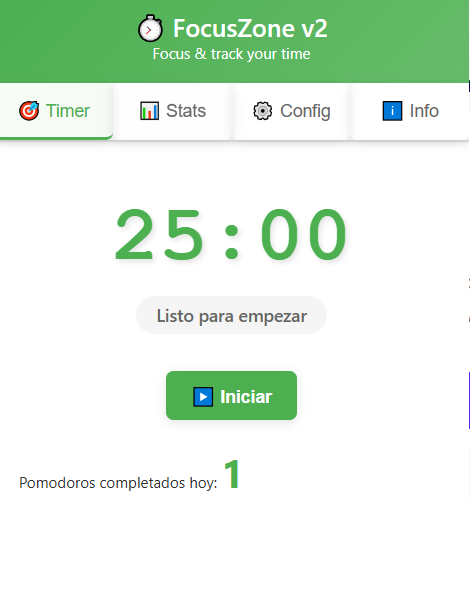
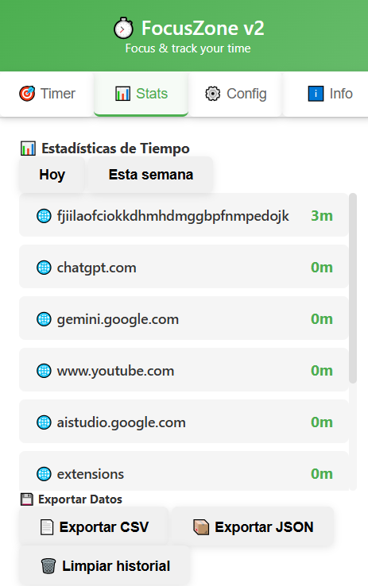
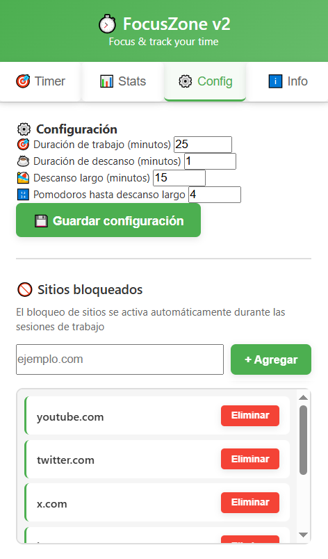
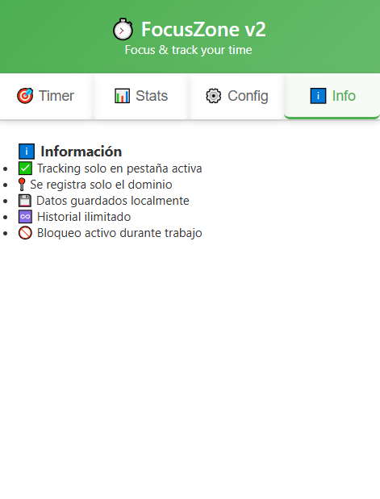

# 🍅 FocusZone v2 - Pomodoro + Tracking + Blocking

<p align="center">
  <table>
    <tr>
      <td></td>
      <td></td>
      <td></td>
      <td></td>
    </tr>
  </table>
</p>

**FocusZone v2** is a Chrome extension that combines a professional Pomodoro timer with automatic time tracking and intelligent site blocking. Stay focused by blocking distractions while automatically tracking which sites you work on, generating detailed productivity statistics.

## 🎯 What is FocusZone v2?

FocusZone v2 is your ultimate productivity assistant, combining three key features in a single extension:

1. **Pomodoro Timer** - Work in focused time intervals (25 minutes) followed by breaks (5 minutes)
2. **Automatic Tracking** - Records exactly how much time you spend on each website during your sessions
3. **Smart Blocking** - Automatically blocks distracting sites only during work (not during breaks)

### How does it work?

1. **Start a focus session** of 25 minutes (or your custom duration)
2. **During those 25 minutes**:
   - FocusZone v2 automatically blocks distracting websites (YouTube, social media, etc.)
   - The system automatically tracks time spent on each work domain
   - If you try to visit a blocked site, you'll see an elegant **motivational page**
3. After completing 25 minutes, you receive a **notification** and a 5-minute break begins
4. **During the break**:
   - All sites are available - relax without restrictions
   - Tracking automatically pauses - your break is private
5. Check your **statistics** to see where you spend your time and export the data

## ✨ Features

### ⏱️ Complete Pomodoro Timer

- **Professional timer** with start, pause, resume, and stop
- **Real-time countdown** visible on the extension icon (badge)
- **System notifications** when completing each Pomodoro
- **Automatic switch** to break periods
- **Daily counter** of completed Pomodoros
- **Configurable times** - customize according to your needs

### 📊 Smart Automatic Tracking

- **Automatic detection** of active tab domain during Pomodoros
- **Precise recording** of time per domain and date
- **Active tabs only** - doesn't record time in background tabs
- **Work time only** - doesn't track during breaks (your break is private)
- **Local storage** - your data remains private on your device
- **No manual intervention** - everything works in the background

### 📈 Statistics and Analysis

- **Time filters**: today's view or last 7 days
- **Top 10 domains** sorted by time spent
- **Readable format** - hours and minutes calculated automatically
- **Clear visualization** - see exactly where you spend your time
- **Informative empty state** when no data is available

### 💾 Data Export

- **CSV format** - ideal for analysis in Excel or Google Sheets
- **JSON format** - perfect for programmatic processing
- **Automatic download** with a single click
- **Complete history** includes tracking and completed Pomodoros
- **Compatible** with data analysis tools

### 🚫 Smart Site Blocking

- **Automatic blocking** during active work sessions
- **11 default sites** blocked (YouTube, Twitter, Instagram, Facebook, Reddit, etc.)
- **Fully customizable list** - add or remove sites according to your needs
- **Elegant blocking page** with motivational message
- **Automatic unblocking** during breaks and pauses
- **4 patterns per site** - effective blocking with and without www

### ⚙️ Flexible Configuration

- **Work duration** configurable (1-120 minutes, default: 25)
- **Break duration** configurable (1-60 minutes, default: 5)
- **Long break** configurable (1-60 minutes, default: 15)
- **Pomodoros until long break** (2-10, default: 4)
- **Automatic persistence** - your configuration is saved locally
- **Live updates** - changes apply immediately

### 🎨 Modern and Intuitive Interface

- **4 organized tabs**: Timer, Statistics, Configuration, and Info
- **Responsive design** optimized for extension popup
- **Clear visual states** - active, paused, break
- **Smooth animations** in transitions
- **Status messages** with instant feedback
- **Modern gradients** and clean design

## 📂 Project Structure

```
FocusZone_v2/
├── manifest.json        # Manifest V3 configuration
├── background.js        # Service worker with timer and tracking logic
├── popup.html           # Visual popup interface
├── popup.js             # UI interaction logic
├── styles.css           # Visual designs and styles
├── blocked.html         # Site blocking page
├── icon.png             
├── README.md            
```

## 🚀 Installation

### Option 1: Manual installation (developer mode)

1. **Download** this folder or clone the repository
2. Open Chrome and go to `chrome://extensions/`
3. Enable **Developer mode** (switch in top right corner)
4. Click **Load unpacked extension**
5. Select the `Extensión FocusZone_v2` folder
6. Done! The ⏱️ icon will appear in your toolbar

### Option 2: Selective download (Git sparse checkout)

```bash
git clone --depth 1 --filter=blob:none --sparse https://github.com/pelejebre/extensiones_chrome.git
cd extensiones_chrome
git sparse-checkout set "Extensión FocusZone_v2"
```

## 📖 How to Use

### Initial Setup

1. **Configure times**: Default is 25 min work and 5 min break
   - You can change them in the "⚙️ Config" tab
   
2. **Customize blocked sites**:
   - The extension includes 11 common sites already blocked
   - Add new sites by typing the domain (e.g., `discord.com`) and clicking "+ Add"
   - Remove sites you don't want to block with the "Remove" button

### Using the Timer

1. **Start session**: Click the **"▶️ Start"** button
   - Timer begins countdown
   - Status changes to "🎯 In Progress"
   - Blocked sites will no longer be accessible
   - Icon badge shows remaining time
   
2. **During the session**:
   - Timer counts down in real-time
   - Your current domain is automatically tracked
   - If you switch tabs, tracking switches to the new domain
   - If you try to visit a blocked site, you'll see a motivational warning page
   - You can pause at any time with **"⏸️ Pause"**
   
3. **Completing the session**:
   - When finished, you'll receive a notification: "🎉 Pomodoro completed!"
   - Mode will automatically switch to "☕ Break"
   - During break, all sites are available
   - Tracking pauses during break
   
4. **Resume/Stop**:
   - **"▶️ Resume"**: Continue from where you left off (when paused)
   - **"⏹️ Stop"**: Cancel current Pomodoro (requires confirmation)

### View Statistics

1. Open the **📊 Stats** tab
2. Select filter:
   - **"Today"**: Shows only today's tracking
   - **"This Week"**: Shows last 7 days
3. You'll see a list of **Top 10 domains** with time spent
4. Format: `github.com: 2h 35m` (hours and minutes)
5. Domains are automatically sorted by time (highest to lowest)

### Export Data

1. In the **Stats** tab, click:
   - **"📄 Export CSV"**: Download .csv file for Excel/Sheets
   - **"📦 Export JSON"**: Download .json file for programmatic analysis
2. The file includes:
   - Complete tracking history (domain, time, date)
   - Completed Pomodoros history (date, time)
3. Data downloads automatically

### Clear History

1. In the **Stats** tab, click **"🗑️ Clear history"**
2. Confirm the action in the dialog
3. This removes:
   - All tracking history
   - All Pomodoros history
4. **Warning**: This action cannot be undone

### Customize Configuration

1. Open the **⚙️ Config** tab
2. **Adjust durations**:
   - **Work duration**: 1-120 minutes (default: 25)
   - **Break duration**: 1-60 minutes (default: 5)
   - **Long break**: 1-60 minutes (default: 15)
   - **Pomodoros until long break**: 2-10 (default: 4)
3. Click **"💾 Save configuration"**
4. You'll see confirmation message: "✅ Configuration saved"
5. **Changes apply immediately** to the timer display
6. **Note**: If timer is running, changes will apply to next Pomodoro

### Manage Blocked Sites

1. In the **⚙️ Config** tab, scroll down to "🚫 Blocked sites"
2. **Add site**:
   - Type the domain in the input (e.g., `facebook.com`)
   - Click **"+ Add"**
   - Site appears in the list immediately
   - Will be automatically blocked in the next session
3. **Remove site**:
   - Click **"Remove"** next to the site you want to allow
   - Site disappears from the list
   - Won't be blocked in future sessions
4. **Important**: Only type the main domain (without `www.` or `https://`)

### Blocking Page

When you try to access a blocked site during focus mode, you'll see:

- 🚫 Large blocking icon
- Title: "Site Blocked"
- Message: "You're in an active Pomodoro session..."
- Name of blocked site
- Motivational phrase
- Elegant design with purple gradient

**Default blocked sites:**

- `youtube.com` - Videos
- `twitter.com` / `x.com` - Social media
- `instagram.com` - Social media
- `facebook.com` - Social media
- `gmail.com` / `mail.google.com` - Email

## ⚙️ Required Permissions

- **storage**: Save configuration, history, and statistics
- **tabs**: Detect active tab for tracking
- **webNavigation**: Intercept navigation to blocked sites
- **declarativeNetRequest**: Block sites dynamically
- **notifications**: Show alerts when completing sessions
- **alarms**: Keep service worker active
- **host_permissions** (`<all_urls>`): Necessary to block any site

## 🔧 Use Cases

### College Student

```
1. Configure 50 minutes work, 10 minutes break
2. Add Discord and Telegram to blocked sites
3. Start session before studying for exam
4. Stay focused for 50 minutes without distractions
5. Review your stats to see which educational sites you used most
```

### Home Office Developer

```
1. Use the standard 25 minutes
2. Block email (gmail.com) during coding sessions
3. Work 2-3 consecutive Pomodoro sessions with breaks
4. Check emails only during breaks
5. Export your tracking to see time on GitHub, StackOverflow, docs, etc.
```

### Freelancer with Multiple Projects

```
1. Work in 25-minute sessions per project
2. Use statistics to bill clients
3. Export CSV data for time reports
4. Analyze which tools/sites you use most per project
5. Block social media during billable hours
```

### Writer/Creative

```
1. Configure long sessions (60-90 minutes)
2. Block social media and news sites
3. Write without interruptions
4. Rest 15 minutes to recharge creativity
5. Track time on Google Docs, Notion, etc. automatically
```

---

## 💡 Productivity Tips

### Effective Pomodoro Technique

1. **Plan ahead**: Decide what you'll do in each session before starting
2. **No multitasking**: One task per Pomodoro session
3. **Respect breaks**: They're an essential part of the method, don't skip them
4. **4 sessions = long break**: After 4 Pomodoros, take 15-30 minutes
5. **Eliminate physical distractions**: Not just digital (phone in airplane mode, etc.)

### Improve Your Focus

- **Mornings**: Longer sessions (50 min) for difficult tasks requiring deep concentration
- **Afternoons**: Standard sessions (25 min) for routine and administrative tasks
- **Customize the list**: Block ONLY the sites that truly distract you
- **Use the statistics**: Analyze where you spend your time and adjust your workflow
- **Celebrate sessions**: Each completed Pomodoro is an achievement

### Maximize Tracking

- **Work in a single tab**: Switch tabs only when changing tasks
- **Use the data**: Export CSV weekly for productivity analysis
- **Identify patterns**: Which sites are you most productive on? Which distract you?
- **Bill accurately**: Use tracking to justify worked hours (freelancers)

---

## 📝 Version

**Version 1.0** - October 2025

### What's New in v2 vs v1

- ✨ **Automatic tracking** of time per domain
- 📊 **Statistics** with time filters (today/week)
- 💾 **Data export** (CSV and JSON)
- 🚀 **Improved blocking system** with declarativeNetRequest API (44 rules)
- ⚙️ **Live config updates** - changes apply immediately
- 🎨 **4 organized tabs** (Timer, Stats, Config, Info)
- 📱 **Dynamic badge** with countdown
- 🔒 **Better privacy** - only records domains, never complete URLs

## 👨‍💻 Author

**pelejebre**

- GitHub: [@pelejebre](https://github.com/pelejebre)
- Repository: [extensiones_chrome](https://github.com/pelejebre/extensiones_chrome)

## 🙏 Credits

- Based on the **Pomodoro Technique** by Francesco Cirillo
- Design inspired by modern productivity tools

---

## 🌟 Like the project?

If FocusZone v2 is useful to you:

- ⭐ **Star** the repository
- 🐛 **Report bugs** in Issues
- 💡 **Suggest features** you'd like to see
- 🤝 **Contribute** with code or documentation
- 📣 **Share** with other developers and users

---

**Boost your productivity, track your time, and stay focused with FocusZone v2! ⏱️✨**
