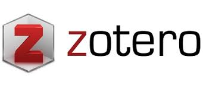
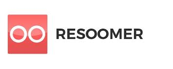

# 🎓 Stack de Recursos para Doctorado

## 📌 Descripción

En esta extensión de Chrome se centraliza y organiza parte de los recursos habituales que utilizo en mis estudios. Un hub completo de herramientas académicas, bases de datos, gestores documentales y recursos institucionales, todo organizado y accesible en un solo lugar.

**Portátil y listo para usar**: Instala esta extensión en cualquier ordenador y tendrás tu stack completo de recursos de investigación siempre disponible con un solo clic.

## ✨ Características Principales

- **Acceso centralizado**: 33 recursos académicos organizados en 5 categorías
- **Navegación intuitiva**: Sistema de menú jerárquico con vistas dedicadas
- **Interfaz moderna**: Gradientes de color, animaciones suaves y tooltips informativos
- **Agrupación visual**: Recursos relacionados agrupados con recuadros de colores
- **Portabilidad total**: Tu stack de doctorado completo en cualquier ordenador
- **Sin scroll**: Interfaz optimizada para visualizar todo sin desplazamiento

## 🚀 Recursos Incluidos (33 total)

### 📚 Bases de Datos Bibliográficas (13 recursos)

Acceso directo a las principales bases de datos académicas:

<p align="center">
  
  
  
  
  
</p>

### 📁 Gestores Documentales (3 recursos)

Herramientas para organizar referencias bibliográficas:

<p align="center">
  
  
  
</p>

### 📊 Herramientas de Análisis (5 recursos)

Visualización y análisis de literatura científica:

<p align="center">
  
  
  
  
  
</p>

### 🔧 Otros Recursos (8 recursos)
Herramientas complementarias organizadas en grupos.
- **Traductores.**
- **IA para Investigación.**
- **Utilidades.**

### 🎓 Recursos USAL (4 recursos)
Servicios específicos de la Universidad de Salamanca.

## 📂 Estructura del Proyecto

```text
Extensión post LinkedIN/
├── manifest.json          # Configuración de la extensión
├── popup.html             # Interfaz de usuario principal
├── popup.js               # Lógica de interacción
├── icon.png               # Icono de la extensión
├── images/                # Recursos gráficos
│   ├── ....
└── README.md              
```

## 🛠️ Instalación

### Instalación Manual (Desarrollador)

1. **Descargar**: Clona o descarga este repositorio

   ```bash
   git clone https://github.com/pelejebre/extensiones_chrome.git
   cd "extensiones_chrome/Extensión doctorado"
   ```

2. **Abrir Chrome**: Ve a `chrome://extensions/`

3. **Modo Desarrollador**: Activa el "Modo de desarrollador" en la esquina superior derecha

4. **Cargar Extensión**: Haz clic en "Cargar extensión sin empaquetar" y selecciona la carpeta de la extensión

5. **¡Listo!**: La extensión aparecerá en tu barra de herramientas

## 🔧 Personalización

### Agregar Nuevo Recurso

Para agregar un nuevo recurso:

1. **Agregar imagen**: Coloca el logo en la carpeta `images/`
2. **Modificar HTML**: Añade un nuevo botón en `popup.html`:

   ```html
   <button class="resource-card nuevo-recurso" data-url="https://nuevo-recurso.com">
       
   </button>
   ```

3. **Actualizar CSS**: Añade un estilo personalizado:

   ```css
   .resource-card.nuevo-recurso { background: linear-gradient(135deg, #color1 0%, #color2 100%); }
   ```

### Cambiar Diseño de Grid

Modifica el número de columnas en el CSS:

```css
.grid-container {
    grid-template-columns: repeat(4, 1fr); /* Cambia el 4 por el número deseado */
}
```

## 🎨 Tecnologías Utilizadas

- **HTML5**: Estructura de la interfaz
- **CSS3**: Estilos y animaciones (Grid Layout 4x3, Flexbox, Transitions)
- **JavaScript**: Lógica de interacción y Chrome Extension APIs
- **Chrome Extension Manifest V3**: Configuración moderna de extensiones

## 🤝 Contribuciones

¡Las contribuciones son bienvenidas! Si deseas:

- Agregar nuevos recursos útiles para LinkedIn
- Mejorar el diseño y UX
- Optimizar el código
- Reportar bugs o sugerir mejoras

Por favor:

1. Fork el repositorio
2. Crea una branch para tu feature (`git checkout -b feature/nuevo-recurso`)
3. Commit tus cambios (`git commit -am 'Agregar nuevo recurso'`)
4. Push a la branch (`git push origin feature/nuevo-recurso`)
5. Abre un Pull Request

## 📝 Changelog

### v1.0.0

- ✨ Lanzamiento inicial
- 📁 9 recursos esenciales para crear posts en LinkedIn
- 🎨 Interfaz moderna con grid de 4 columnas
- 🚀 Integración de herramientas de almacenamiento, búsqueda e IA

## 📄 Licencia

Este proyecto es **código abierto** y de **uso completamente libre**. Puedes:

- ✅ **Usar** la extensión para cualquier propósito
- ✅ **Modificar** el código según tus necesidades
- ✅ **Distribuir** copias del proyecto
- ✅ **Crear derivados** y mejoras
- ✅ **Uso comercial** sin restricciones

**No se requiere atribución**, aunque se agradece. Este proyecto está disponible bajo la **Licencia MIT**, lo que garantiza máxima libertad de uso.

> 💡 **Filosofía del proyecto**: Herramientas abiertas para creadores de contenido. Creemos en democratizar el acceso a recursos que potencien la creatividad y productividad en LinkedIn.

## 👨‍💻 Autor

**pelejebre** - [GitHub](https://github.com/pelejebre)

## 🌟 ¿Te gusta el proyecto?

Si esta extensión te resulta útil para crear contenido en LinkedIn, ¡dale una estrella ⭐ al repositorio!