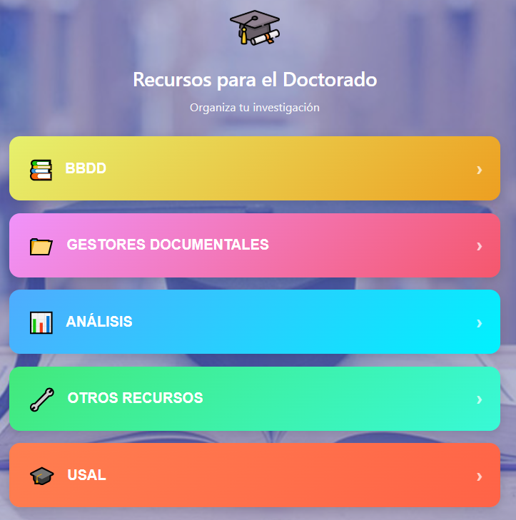

# 🎓 PhD Resource Stack

<p align="center"></p>

## 📌 Description

This Chrome extension centralizes and organizes some of the usual resources I use in my studies. A complete hub of academic tools, databases, reference managers and institutional resources, all organized and accessible in one place.

**Portable and ready to use**: Install this extension on any computer and have your complete research resource stack always available with just one click.

## ✨ Key Features

- **Centralized access**: 33 academic resources organized into 5 categories
- **Intuitive navigation**: Hierarchical menu system with dedicated views
- **Modern interface**: Color gradients, smooth animations and informative tooltips
- **Visual grouping**: Related resources grouped with colored boxes
- **Total portability**: Your complete PhD stack on any computer
- **No scrolling**: Optimized interface to view everything without scrolling

## 🚀 Included Resources (33 total)

### 📚 Bibliographic Databases (13 resources)

Direct access to the main academic databases:

<p align="center">
  
  
  
  
  
</p>

### 📁 Reference Managers (3 resources)

Tools to organize bibliographic references:

<p align="center">
  
  
  
</p>

### 📊 Analysis Tools (5 resources)

Visualization and analysis of scientific literature:

<p align="center">
  
  
  
  
  
</p>

### 🔧 Other Resources (8 resources)
Complementary tools organized in groups.
- **Translators.**
- **AI for Research.**
- **Utilities.**

### 🎓 USAL Resources (4 resources)
Specific services from the University of Salamanca.

## 📂 Project Structure

```text
Extensión doctorado/
├── manifest.json          # Extension configuration
├── popup.html             # Main user interface
├── popup.js               # Interaction logic
├── icon.png               # Extension icon
├── images/                # Graphic resources
│   ├── ....
└── README.md              
```

## 🛠️ Installation

### Manual Installation (Developer)

1. **Download**: Download only the "Extensión doctorado" folder

   **Option A - Using Git (Sparse Checkout):**
   ```bash
   git clone --depth 1 --filter=blob:none --sparse https://github.com/pelejebre/extensiones_chrome.git
   cd extensiones_chrome
   git sparse-checkout set "Extensión doctorado"
   ```

   **Option B - Direct download:**
   - Go to the repository on GitHub
   - Navigate to the "Extensión doctorado" folder
   - Download the files manually or use [DownGit](https://minhaskamal.github.io/DownGit)

2. **Open Chrome**: Go to `chrome://extensions/`

3. **Developer Mode**: Enable "Developer mode" in the top right corner

4. **Load Extension**: Click "Load unpacked" and select the extension folder

5. **Done!**: The extension will appear in your toolbar

## 🔧 Customization

### Add New Resource

To add a new resource:

1. **Add image**: Place the logo in the `images/` folder
2. **Modify HTML**: Add a new button in `popup.html`:

   ```html
   <button class="resource-card new-resource" data-url="https://new-resource.com">
       
   </button>
   ```

3. **Update CSS**: Add a custom style:

   ```css
   .resource-card.new-resource { background: linear-gradient(135deg, #color1 0%, #color2 100%); }
   ```

### Change Grid Layout

Modify the number of columns in the CSS:

```css
.grid-container {
    grid-template-columns: repeat(4, 1fr); /* Change 4 to the desired number */
}
```

## 🎨 Technologies Used

- **HTML5**: Interface structure
- **CSS3**: Styles and animations (Grid Layout 4x3, Flexbox, Transitions)
- **JavaScript**: Interaction logic and Chrome Extension APIs
- **Chrome Extension Manifest V3**: Modern extension configuration

## 🤝 Contributions

Contributions are welcome! If you want to:

- Add new useful resources for academic research
- Improve design and UX
- Optimize the code
- Report bugs or suggest improvements

Please:

1. Fork the repository
2. Create a branch for your feature (`git checkout -b feature/new-resource`)
3. Commit your changes (`git commit -am 'Add new resource'`)
4. Push to the branch (`git push origin feature/new-resource`)
5. Open a Pull Request

## 📝 Changelog

### v1.0.0

- ✨ Initial release
- 📚 13 bibliographic databases
- 📁 3 reference managers
- 📊 5 analysis and visualization tools
- 🔧 8 complementary resources (translators, AI, utilities)
- 🎓 4 USAL institutional resources
- 🎨 Modern interface with hierarchical navigation
- Total: 33 centralized academic resources

## 📄 License

This project is **open source** and **completely free to use**. You can:

- ✅ **Use** the extension for any purpose
- ✅ **Modify** the code according to your needs
- ✅ **Distribute** copies of the project
- ✅ **Create derivatives** and improvements
- ✅ **Commercial use** without restrictions

**No attribution required**, although it is appreciated. This project is available under the **MIT License**, which guarantees maximum freedom of use.

> 💡 **Project philosophy**: Open tools for researchers. Your complete, organized and portable PhD stack to work from any computer.

## 👨‍💻 Author

**pelejebre** - [GitHub](https://github.com/pelejebre)

Developed as a personal tool to optimize workflow during PhD studies at the University of Salamanca.

## 🌟 Like the project?

If you find this extension useful for your PhD research, give it a star ⭐ on the repository!

## 📬 Contact and Feedback

If you have suggestions, find bugs or want to share how you use this extension in your research, feel free to:

- Open an **Issue** on GitHub
- Send a **Pull Request** with improvements
- Share your experience in the **Discussions** section